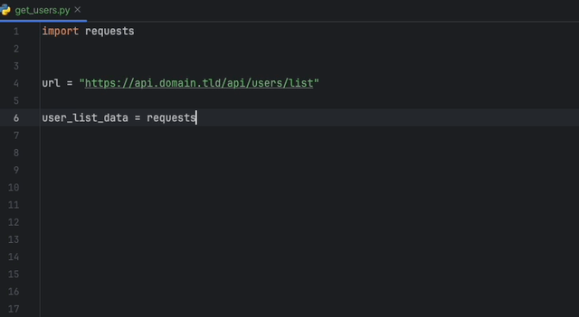
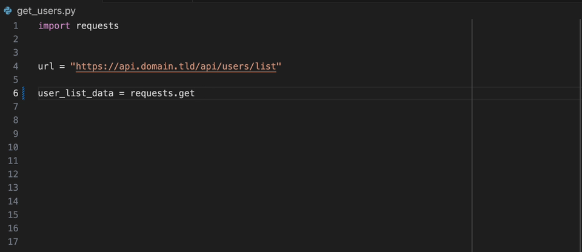

# Datadog Static Analyzer

> [!TIP]
> Datadog supports open source projects. Learn more on [Datadog for Open Source Projects](https://www.datadoghq.com/partner/open-source/).

datadog-static-analyzer is the static analyzer engine for Datadog [static analysis](https://www.datadoghq.com/code-analysis/).

## How to use Datadog Static Analysis Tool

### Quick Start

1. Download the binary from the [releases](https://github.com/DataDog/datadog-static-analyzer/releases)
2. Run the analyzer on your repository (as shown below)
3. It will run the analyzer with the default rules available for the support languages

```shell
datadog-static-analyzer --directory /path/to/directory --output report.csv --format csv
```

#### Using Docker

```shell
docker run -it --rm -v /path/to/directory:/data ghcr.io/datadog/datadog-static-analyzer:latest --directory /data --output /data/report.csv --format csv
```

For more information on the Docker container, see the documentation [here](./doc/docker-container.md).

If you encounter an issue, read the [Frequently Asked Questions](FAQ.md) first, it may contain
the solution to your problem.

### Advanced Usage

You can choose the rules to use to scan your repository by creating a `static-analysis.datadog.yml` file.

First, make sure you follow the [documentation](https://docs.datadoghq.com/code_analysis/static_analysis)
and create a `static-analysis.datadog.yml` file at the root of your project with the rulesets you want to use.

All the rules can be found on the [Datadog documentation](https://docs.datadoghq.com/security/code_security/static_analysis/static_analysis_rules/). Your `static-analysis.datadog.yml` may only contain rulesets available from the [Datadog documentation](https://docs.datadoghq.com/security/code_security/static_analysis/static_analysis_rules/)

Example of YAML file

```yaml
schema-version: v1
rulesets:
  - python-code-style
  - python-best-practices
  - python-inclusive
ignore:
  - tests
```

### CI/CD Integration

You can use it in your CI/CD pipeline using our integration:

- [GitHub Action](https://github.com/DataDog/datadog-static-analyzer-github-action)
- [CircleCI ORB](https://circleci.com/developer/orbs/orb/datadog/datadog-static-analyzer-circleci-orb)

If you use it in your own CI/CD pipeline, you can integrate the tool directly: see the [Datadog documentation for more information](https://docs.datadoghq.com/security/code_security/static_analysis/setup).

### IntelliJ JetBrains products

The [Datadog IntelliJ extension](https://plugins.jetbrains.com/plugin/19495-datadog) allows you to use the static analyzer directly from all JetBrains products.
Create a `static-analysis.datadog.yml` file, download the extension and you can start using it. You can see below an example of a suggestion to add a timeout
when fetching data with Python with the requests module.



### VS Code

The [Datadog VS Code extension](https://marketplace.visualstudio.com/items?itemName=Datadog.datadog-vscode) allows you to use the static analyzer directly from VS Code.
Create a `static-analysis.datadog.yml` file, download the extension and you can start using it.



## List of rulesets

When you onboard on the Datadog product, you can select the ruleset you want/need. If you are not using Datadog directly, 
there is the list of common used rulesets available in the Datadog static analysis product per language.

The complete list is available in [our documentation](https://docs.datadoghq.com/security/code_security/static_analysis/static_analysis_rules/).

The list of rulesets is available in [RULESETS.md](RULESETS.md).

## Download

Download the latest release for your system and architecture from the [release page](https://github.com/DataDog/datadog-static-analyzer/releases/latest).

To get the static analyzer via shell:

```shell
curl -L -O https://www.github.com/DataDog/datadog-static-analyzer/releases/latest/download/datadog-static-analyzer-<target>.zip
```

Example to get the x86_64 binary for Linux:

```shell
curl -L -O https://www.github.com/DataDog/datadog-static-analyzer/releases/latest/download/datadog-static-analyzer-x86_64-unknown-linux-gnu.zip
```

## Usage

```shell
datadog-static-analyzer -i <directory> -o <output-file>
```

For the tool to work, you must have a `<directory>/static-analysis.datadog.yml` file that defines the configuration of the analyzer. This file will indicate the rules you will use for your project.

You can get more information about the configuration on [Datadog documentation](https://docs.datadoghq.com/security/code_security/static_analysis/setup).

### Mac OS X users

The binary cannot be executed as is. You need to flag the binary as safe to execute using the following command.

```shell
xattr -dr com.apple.quarantine datadog-static-analyzer
```

## Options

 - `-f` or `--format`: format of the output file. `-f sarif` produces a [SARIF-compliant file](https://www.oasis-open.org/committees/tc_home.php?wg_abbrev=sarif)
 - `-r` or `--rules`: provides a file that contains all rules (rules can be put in a file using `datadog-export-rulesets`)
 - `-c` or `--cpus`: number of cores used to analyze (count about 1GB of RAM usage per core)
 - `-o` or `--output`: output file
 - `-p` or `--ignore-path`: path (pattern/glob) to ignore; accepts multiple
 - `-x` or `--performance-statistics`: show performance statistics for the analyzer
 - `-g` or `--add-git-info`: add Git-related information (sha, etc) into the SARIF report when using -f sarif
 - `--fail-on-any-violation`: make the program exit a non-zero exit code if there is at least one violation of a given severity.
 - `-w` or `--diff-aware`: enable diff-aware scanning (see dedicated notes below)

## Configuration

Set the following variables to configure an analysis:

 - `DD_SITE`: the Datadog site parameter used to fetch rules ([view list](https://docs.datadoghq.com/getting_started/site/)) (default: `datadoghq.com`)

## Configuration file

The static analyzer can be configured using a `static-analysis.datadog.yml` file
at the root directory of the repository. This is a YAML file with the following entries:

- `rulesets`: (required) a list with all the rulesets to use for this repository (see [Datadog Documentation](https://docs.datadoghq.com/security/code_security/static_analysis/static_analysis_rules/) for a full list). The elements of this list must be strings or maps containing a configuration for a ruleset (described below.)
- `ignore`: (optional) a list of path prefixes and glob patterns to ignore. A file that matches any of its entries will not be analyzed.
- `only`: (optional) a list of path prefixes and glob patterns to analyze. If `only` is specified, only files that match one of its entries will be analyzed.
- `ignore-gitignore`: (optional) by default, any entries found in the `.gitignore` file are added to the `ignore` list. If the `ignore-gitignore` option is true, the `.gitignore` file is not read.
- `max-file-size-kb`: (optional) files larger than this size, in kilobytes, will be ignored. The default value is 200 kB.
- `schema-version`: (optional) the version of the schema that this configuration file follows. If specified, it must be `v1`.

The entries of the `rulesets` list must be strings that contain the name of a ruleset to enable, or a map that contains the configuration for a ruleset. This map contains the following fields:

- the first field (required) gives the ruleset name as its key, with an empty value.
- `ignore`: (optional) a list of path prefixes and glob patterns to ignore _for this ruleset_. Rules in this ruleset will not be evaluated for any files that match any of the entries in the `ignore` list.
- `only`: (optional) a list of path prefixes and glob patterns to analyze _for this ruleset_. If `only` is specified, rules in this ruleset will only be evaluated for files that match one of the entries.
- `rules`: (optional) a map of rule configurations. Rules not specified in this map will still be evaluated, but with their default configuration.

The map in the `rules` field uses the rule's name as its key, and the values are maps with the following fields:

- `ignore` (optional) a list of path prefixes and glob patterns to ignore _for this rule_. This rule will not be evaluated for any files that match any of the entries in the `ignore` list.
- `only`: (optional) a list of path prefixes and glob patterns to analyze _for this rule_. If `only` is specified, this rule will only be evaluated for files that match one of the entries.
- `severity`: (optional) if provided, override the severity of violations produced by this rule. The valid severities are `ERROR`, `WARNING`, `NOTICE`, and `NONE`.
- `category`: (optional) if provided, override this rule's category. The valid categories are `BEST_PRACTICES`, `CODE_STYLE`, `ERROR_PRONE`, `PERFORMANCE`, and `SECURITY`.
- `arguments`: (optional) a map of values for the rule's arguments.

The map in the `arguments` field uses an argument's name as its key, and the values are either strings or maps:

- if you want to set a value for the whole repository, you can specify it as a string;
- if you want to set different values for different subtrees in the repository, you can specify them as a map from a subtree prefix to the value that the argument will have within that subtree. See the example for more details.

An annotated example of a configuration file:

```yaml
# This is a "v1" configuration file.
schema-version: v1
# The list of rulesets to enable for this repository.
rulesets:
  # Enable the `python-inclusive` ruleset with the default configuration.
  - python-inclusive
  # Enable the `python-best-practices` ruleset with a custom configuration.
  - python-best-practices:
    # Do not apply any of the rules in this ruleset to files that match `src/**/*.generated.py`.
    ignore:
      - src/**/*.generated.py
    rules:
      # Special configuration for the `python-best-practices/no-generic-exception` rule.
      no-generic-exception:
        # Treat violations of this rule as errors (normally "notice").
        severity: ERROR
        # Classify violations of this rule under the "code style" category.
        category: CODE_STYLE
        # Only apply this rule to files under the `src/new-code` subtree.
        only:
          - src/new-code
  # Enable the `python-code-style ruleset` with a custom configuration.
  - python-code-style:
    rules:
      max-function-lines:
        # Set arguments for the `python-code-style/max-function-lines` rule.
        arguments:
          # Set the `max-lines` argument to 150 in the whole repository.
          max-lines: 150
      max-class-lines:
        # Set arguments for the `python-code-style/max-class-lines` rule.
        arguments:
          # Set different values for the `max-lines` argument in different subtrees.
          max-lines:
            # Set the `max-lines` argument to 100 by default
            /: 100
            # Set the `max-lines` argument to 75 under the `src/new-code` subtree.
            src/new-code: 75
# Analyze only files in the `src` and `imported` subtrees.
only:
  - src
  - imported
# Do not analyze any files in the `src/tests` subtree.
ignore:
  - src/tests
# Do not add the content of the `.gitignore` file to the `ignore` list.
ignore-gitignore: true
# Do not analyze files larger than 100 kB.
max-file-size-kb: 100
```

Another example that shows every option being used:

```yaml
schema-version: v1
rulesets:
  - python-best-practices
  - python-code-style:
    ignore:
      - src/generated
      - src/**/*_test.py
    only:
      - src
      - imported/**/new/**
    rules:
      max-function-lines:
        severity: WARNING
        category: PERFORMANCE
        ignore:
          - src/new-code
          - src/new/*.gen.py
        only:
          - src/new
          - src/**/new-code/**
        arguments:
          max-lines: 150
          min-lines:
            /: 10
            src/new-code: 0
ignore:
  - dist
  - lib/**/*.py
only:
  - src
  - imported/**/*.py
ignore-gitignore: true
max-file-size-kb: 256
```

## Configuration file schema

There is a JSON Schema definition for the `static-analysis.datadog.yml` in the `schema` subdirectory.

You can use it to check the syntax of your configuration file:

1. Execute `npx --yes ajv-cli@5.0.0 validate -s schema/schema.json -r schema/*/*.json -d path/to/your/static-analysis.datadog.yml`

There are some examples of valid and invalid configuration files in the [`schema/examples/valid`](schema/examples/valid)
and [`schema/examples/invalid`](schema/examples/invalid) subdirectories, respectively. If you make changes to the JSON
Schema, you can test them against our examples:

1. Execute `make -C schema`

## Diff-Aware Scanning

Diff-aware scanning is a feature of the static-analyzer to only scan the files that have been
recently changed. Diff-aware scans use previous results and add only the violations from the
changed files.

In order to use diff-aware scanning, you must be a Datadog customer.

To use diff-aware scanning:

 1. Set up the `DD_SITE` environment variable according to the Datadog datacenter you are using (https://docs.datadoghq.com/getting_started/site/)
 2. Set up the `DD_APP_KEY` and `DD_API_KEY` environment variables with your Datadog application and API keys
 3. Run the static analyzer with option `--diff-aware`

When using diff-aware, the static analyzer will connect to Datadog and attempt a previous analysis to use. If any problem occurs
and diff-aware cannot be used, the analyzer will output an error like the one below and continue with a full scan.

You can use the option `--debug true` to troubleshoot further if needed.

```shell
$ datadog-static-analyzer --directory /path/to/code --output output.sarif --format sarif --diff-aware

...
diff aware not enabled (error when receiving diff-aware data from Datadog with config hash 16163d87d4a1922ab89ec891159446d1ce0fb47f9c1469448bb331b72d19f55c, sha 5509900dc490cedbe2bb64afaf43478e24ad144b), proceeding with full scan.
...
```

## Other Tools

### datadog-export-rulesets

Export rulesets from the API into a file

```shell
cargo run --locked --bin datadog-export-rulesets -- -r <ruleset> -o <file-to-export>
```

## More

 - [How diff-aware scanning works](doc/diff-aware.md)
 - [Report an issue](doc/report-issue.md)
 - [OWASP Benchmark](doc/owasp-benchmark.md)

## Contribute

See file [CONTRIBUTING.md](CONTRIBUTING.md) for more information as well as [DEVELOPMENT.md](DEVELOPMENT.md)
for all details about testing and coding guidelines.

## More information

 - [Datadog Static Analysis](https://docs.datadoghq.com/security/code_security/static_analysis/)
