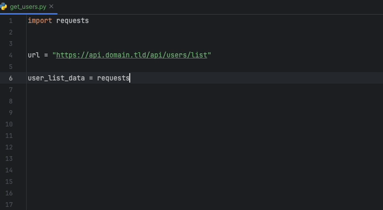
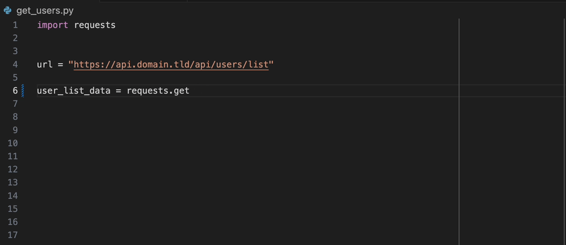

# Datadog Static Analyzer

> [!TIP]
> Datadog supports open source projects. Learn more on [Datadog for Open Source Projects](https://www.datadoghq.com/partner/open-source/).

datadog-static-analyzer is the static analyzer engine for Datadog [static analysis](https://www.datadoghq.com/code-analysis/).

## How to use Datadog Static Analysis Tool

### Quick Start

#### Installation on macOS

On macOS, you can install the static analyzer using Homebrew:

```shell
brew install datadog-static-analyzer
```

#### Installation on other platforms

1. Download the binary from the [releases](https://github.com/DataDog/datadog-static-analyzer/releases)
2. Extract and run the analyzer on your repository (as shown below)

#### Running the analyzer

Once installed, run the analyzer with the default rules:

```shell
datadog-static-analyzer --directory /path/to/directory --output report.csv --format csv
```

#### Using Docker

```shell
docker run -it --rm -v /path/to/directory:/data ghcr.io/datadog/datadog-static-analyzer:latest --directory /data --output /data/report.csv --format csv
```

For more information on the Docker container, see the documentation [here](./doc/docker-container.md).

If you encounter an issue, read the [Frequently Asked Questions](FAQ.md) first, it may contain
the solution to your problem.

### Advanced Usage

You can choose the rules to use to scan your repository by creating a `code-security.datadog.yaml` file.

First, make sure you follow the [documentation](https://docs.datadoghq.com/code_analysis/static_analysis)
and create a `code-security.datadog.yaml` file at the root of your project with the rulesets you want to use.

Example of YAML file

```yaml
schema-version: v1.0
sast:
  use-rulesets:
    - python-code-style
    - python-best-practices
    - python-inclusive
  global-config:
    ignore-paths:
      - src/experiments
```

### CI/CD Integration

You can use it in your CI/CD pipeline using our integration:

- [GitHub Action](https://github.com/DataDog/datadog-static-analyzer-github-action)
- [CircleCI ORB](https://circleci.com/developer/orbs/orb/datadog/datadog-static-analyzer-circleci-orb)

If you use it in your own CI/CD pipeline, you can integrate the tool directly: see the [Datadog documentation for more information](https://docs.datadoghq.com/security/code_security/static_analysis/setup).

### IntelliJ JetBrains products

The [Datadog IntelliJ extension](https://plugins.jetbrains.com/plugin/19495-datadog) allows you to use the static analyzer directly from all JetBrains products.
Create a configuration file ([reference here](doc/legacy_config.md)), download the extension, and you can start using it.
You can see below an example of a suggestion to add a timeout when fetching data with Python with the requests module.



### VS Code

The [Datadog VS Code extension](https://marketplace.visualstudio.com/items?itemName=Datadog.datadog-vscode) allows you to use the static analyzer directly from VS Code.
Create a configuration file ([reference here](doc/legacy_config.md)), download the extension, and you can start using it.



## List of rulesets

When you onboard on the Datadog product, you can select the ruleset you want/need. If you are not using Datadog directly, 
there is the list of common used rulesets available in the Datadog static analysis product per language.

The complete list is available in [our documentation](https://docs.datadoghq.com/security/code_security/static_analysis/static_analysis_rules/).

The list of rulesets is available in [RULESETS.md](RULESETS.md).

## Download

Download the latest release for your system and architecture from the [release page](https://github.com/DataDog/datadog-static-analyzer/releases/latest).

To get the static analyzer via shell:

```shell
curl -L -O https://www.github.com/DataDog/datadog-static-analyzer/releases/latest/download/datadog-static-analyzer-<target>.zip
```

Example to get the x86_64 binary for Linux:

```shell
curl -L -O https://www.github.com/DataDog/datadog-static-analyzer/releases/latest/download/datadog-static-analyzer-x86_64-unknown-linux-gnu.zip
```

## Usage

```shell
datadog-static-analyzer -i <directory> -o <output-file>
```

### Mac OS X users

If you installed via Homebrew (`brew install datadog-static-analyzer`), you can skip this section.

If you downloaded the binary manually, it cannot be executed as is. You need to flag the binary as safe to execute using the following command:

```shell
xattr -dr com.apple.quarantine datadog-static-analyzer
```

## Options

 - `-f` or `--format`: format of the output file. `-f sarif` produces a [SARIF-compliant file](https://www.oasis-open.org/committees/tc_home.php?wg_abbrev=sarif)
 - `-r` or `--rules`: provides a file that contains all rules (rules can be put in a file using `datadog-export-rulesets`)
 - `-c` or `--cpus`: number of cores used to analyze (count about 1GB of RAM usage per core)
 - `-o` or `--output`: output file
 - `-p` or `--ignore-path`: path (pattern/glob) to ignore; accepts multiple
 - `-x` or `--performance-statistics`: show performance statistics for the analyzer
 - `-g` or `--add-git-info`: add Git-related information (sha, etc) into the SARIF report when using -f sarif
 - `--fail-on-any-violation`: make the program exit a non-zero exit code if there is at least one violation of a given severity.
 - `-w` or `--diff-aware`: enable diff-aware scanning (see dedicated notes below)

## Configuration

Set the following variables to configure an analysis:

 - `DD_SITE`: the Datadog site parameter used to fetch rules ([view list](https://docs.datadoghq.com/getting_started/site/)) (default: `datadoghq.com`)

## Configuration file

The static analyzer can be configured using a `code-security.datadog.yaml` file at the root directory of the repository. 
The file must begin with `schema-version: v1.0` and should have a `sast` object specifying the configuration.

```yaml
schema-version: v1.0
sast:
  # ... configuration goes here
```

The **sast object** supports the following fields:

| **Property** | **Type** | **Description** | **Default** |
| --- | --- | --- | --- |
| `use-default-rulesets` | Boolean | Whether to enable Datadog default rulesets. | `true` |
| `use-rulesets` | Array | A list of ruleset names to enable ([custom rulesets](https://docs.datadoghq.com/security/code_security/static_analysis/custom_rules/tutorial/) or [Datadog default rulesets](https://docs.datadoghq.com/security/code_security/static_analysis/static_analysis_rules/)). Enabled in addition to the default rulesets if `use-default-rulesets` is `true`. | None |
| `ignore-rulesets` | Array | A list of ruleset names to disable. Takes precedence over `use-rulesets` and `use-default-rulesets`. | None |
| `ruleset-configs` | Object | A map from ruleset name to its configuration. | None |
| `global-config` | Object | Global settings for the repository. | None |

### Ruleset configuration

Each entry in the `ruleset-configs` map configures a specific ruleset. A ruleset does not need to be listed in `use-rulesets` for its configuration to apply; the configuration is used whenever the ruleset is enabled, including through `use-default-rulesets`.

| **Property** | **Type** | **Description** | **Default** |
| --- | --- | --- | --- |
| `only-paths` | Array | File paths or glob patterns. Only files matching these patterns are processed for this ruleset. | None |
| `ignore-paths` | Array | File paths or glob patterns to exclude from analysis for this ruleset. | None |
| `rule-configs` | Object | A map from rule name to its configuration. | None |

### Rule configuration

Each entry in the `rule-configs` map configures a specific rule:

| **Property** | **Type** | **Description** | **Default** |
| --- | --- | --- | --- |
| `only-paths` | Array | File paths or glob patterns. The rule is applied only to files matching these patterns. | None |
| `ignore-paths` | Array | File paths or glob patterns to exclude. The rule is not applied to files matching these patterns. | None |
| `arguments` | Object | Parameters and values for the rule. Values can be scalars or defined per path. | None |
| `severity` | String or Object | The rule severity. Valid values: `ERROR`, `WARNING`, `NOTICE`, `NONE`. Can be a single value or defined per path. | None |
| `category` | String | The rule category. Valid values: `BEST_PRACTICES`, `CODE_STYLE`, `ERROR_PRONE`, `PERFORMANCE`, `SECURITY`. | None |

## Argument and severity configuration

Arguments and severity can be defined in one of two formats:

1. **Single value:** Applies to the whole repository.

```yaml
arguments:
  argument-name: value
severity: ERROR
```

2. **Per-path mapping:** Different values for different subtrees. The longest matching path prefix applies. Use `/` as a catch-all default.

    ```yaml
    arguments:
      argument-name:
        /: value_default
        path/example: value_specific
    severity:
      /: WARNING
      path/example: ERROR
    ```

The `category` field takes a single string value for the whole repository.

### Global configuration

The `global-config` object controls repository-wide settings and has the following optional fields:

| **Property** | **Type** | **Description** | **Default** |
| --- | --- | --- | --- |
| `only-paths` | Array | File paths or glob patterns. Only matching files are analyzed. | None |
| `ignore-paths` | Array | File paths or glob patterns to exclude. Matching files are not analyzed. | None |
| `use-gitignore` | Boolean | Whether to include entries from the `.gitignore` file in `ignore-paths`. | `true` |
| `ignore-generated-files` | Boolean | Whether to include common generated file patterns in `ignore-paths`. | `true` |
| `max-file-size-kb` | Number | Maximum file size (in kB) to analyze. Larger files are ignored. | `200` |

An annotated example of a configuration file:

```yaml
schema-version: v1.0
sast:
  # Always ensure the following rulesets are run (in addition to the Datadog defaults).
  use-rulesets:
    - python-inclusive
    - my-custom-python-rules
  # Never use the following rulesets (even if they are in the Datadog defaults).
  ignore-rulesets:
    - python-pandas
  ruleset-configs:
    # Configuration for the `python-best-practices` ruleset.
    python-best-practices:
      # Do not apply any of the rules in this ruleset to files that match `**/*_model.py`.
      ignore-paths:
        - "**/*_model.py"
      rule-configs:
        # Special configuration for the `python-best-practices/no-generic-exception` rule.
        no-generic-exception:
          # Treat violations of this rule as errors.
          severity: ERROR
          # Classify violations of this rule under the "code style" category.
          category: CODE_STYLE
          # Only apply this rule to files under the `src/new-code` subtree.
          only-paths:
            - src/new-code
    # Configuration for the `python-code-style` ruleset.
    python-code-style:
      rule-configs:
        max-function-lines:
          # Set arguments for the `python-code-style/max-function-lines` rule.
          arguments:
            # Set the `max-lines` argument to 150 in the whole repository.
            max-lines: 150
        max-class-lines:
          # Set arguments for the `python-code-style/max-class-lines` rule.
          arguments:
            # Set different values for the `max-lines` argument in different subtrees.
            max-lines:
              # 100 lines by default.
              /: 100
              # 75 lines under the `src/new-code` subtree.
              src/new-code: 75
  # Repository-wide settings.
  global-config:
    # Analyze only files in the `src` and `imported` subtrees.
    only-paths:
      - src
      - imported
    # Do not analyze any files in the `src/third_party` subtree.
    ignore-paths:
      - src/third_party
    # Do not analyze files larger than 100 kB.
    max-file-size-kb: 100
```

Another example that shows every option being used:

```yaml
schema-version: v1.0
sast:
  use-default-rulesets: false
  use-rulesets:
    - python-code-style
  ignore-rulesets:
    - python-pandas
  ruleset-configs:
    python-code-style:
      ignore-paths:
        - src/third_party
        - src/**/*_test.py
      only-paths:
        - src
        - imported/**/new/**
      rule-configs:
        max-function-lines:
          severity: WARNING
          category: PERFORMANCE
          ignore-paths:
            - src/new-code
            - src/new/*_gen.py
          only-paths:
            - src/new
            - src/**/new-code/**
          arguments:
            max-lines: 150
            min-lines:
              /: 10
              src/new-code: 0
  global-config:
    ignore-paths:
      - dist
      - lib/**/*.py
    only-paths:
      - src
      - imported/**/*.py
    use-gitignore: false
    ignore-generated-files: false
    max-file-size-kb: 256
```

## Configuration file schema

You can use the included JSON schema definition to check the syntax of your configuration file:

1. Execute `npx --yes ajv-cli@5.0.0 validate --spec=draft2020 -s schema/sast/v1.0/validation.schema.json -r schema/sast/v1.0/schema.json -d path/to/your/code-security.datadog.yaml`

## Diff-Aware Scanning

Diff-aware scanning is a feature of the static-analyzer to only scan the files that have been
recently changed. Diff-aware scans use previous results and add only the violations from the
changed files.

In order to use diff-aware scanning, you must be a Datadog customer.

To use diff-aware scanning:

 1. Set up the `DD_SITE` environment variable according to the Datadog datacenter you are using (https://docs.datadoghq.com/getting_started/site/)
 2. Set up the `DD_APP_KEY` and `DD_API_KEY` environment variables with your Datadog application and API keys
 3. Run the static analyzer with option `--diff-aware`

When using diff-aware, the static analyzer will connect to Datadog and attempt a previous analysis to use. If any problem occurs
and diff-aware cannot be used, the analyzer will output an error like the one below and continue with a full scan.

You can use the option `--debug true` to troubleshoot further if needed.

```shell
$ datadog-static-analyzer --directory /path/to/code --output output.sarif --format sarif --diff-aware

...
diff aware not enabled (error when receiving diff-aware data from Datadog with config hash 16163d87d4a1922ab89ec891159446d1ce0fb47f9c1469448bb331b72d19f55c, sha 5509900dc490cedbe2bb64afaf43478e24ad144b), proceeding with full scan.
...
```

## Other Tools

### datadog-export-rulesets

Export rulesets from the API into a file

```shell
cargo run --locked --bin datadog-export-rulesets -- -r <ruleset> -o <file-to-export>
```

## More

 - [How diff-aware scanning works](doc/diff-aware.md)
 - [Report an issue](doc/report-issue.md)
 - [OWASP Benchmark](doc/owasp-benchmark.md)

## Contribute

See file [CONTRIBUTING.md](CONTRIBUTING.md) for more information as well as [DEVELOPMENT.md](DEVELOPMENT.md)
for all details about testing and coding guidelines.

## More information

 - [Datadog Static Analysis](https://docs.datadoghq.com/security/code_security/static_analysis/)

