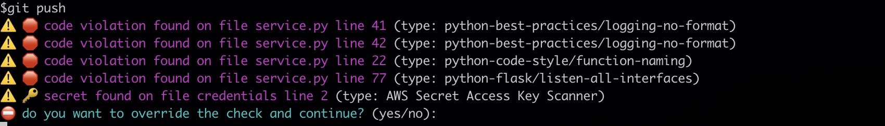

## Git Hooks

Git hooks are supported for Datadog Static Analyzer. Using
Git hooks prevent you from pushing or committing any code that contains
a violation or a secret.

### How to use

The `datadog-static-analyzer-git-hook` program ([source](../crates/bins/src/bin/datadog-static-analyzer-git-hook))
is designed to be integrated in [Git Hooks](https://git-scm.com/book/en/v2/Customizing-Git-Git-Hooks),
either `pre-commit` or `pre-push`.

The program needs to be in the `$PATH` environment variable of the current user.

You have two modes to invoke the program:

- compare the current branch with a default branch
- compare two shas

### Compare the current branch with a default branch

To compare the current commit with the default branch main, invoke the following command.

```shell
datadog-static-analyzer-git-hook -r <path/to/repo> --secrets  --default-branch main
```

### Compare two commit shas

To compare the commit `<sha1>` and `<sha2>` (`<sha1>` has been committed before `<sha2>`), enter the following command.

```shell
datadog-static-analyzer-git-hook -r <path/to/repo> --static-analysis --secrets  --sha-start <sha1> --sha-end <sha2>
```

### Options

- `--enable-static-analysis`: check for any static analysis error (value: true/false)
- `--enable-secrets`: also validate secrets (value: true/false)
  with [Datadog Sensitive Data Scanner](https://docs.datadoghq.com/sensitive_data_scanner/)
- `--confirmation`: prompts the user if they want to bypass the warning

### Example of Integration

#### Step 1: ensure that `datadog-static-analyzer-git-hook` is in your PATH

Make sure you copy the `datadog-static-analyzer-git-hook` in your `PATH` and you can invoke it.

#### Step 2: add Git `pre-commit` script

In your repository, create a file `.git/hooks/pre-push` with the following content.
With this file, the datadog static analyzer will check that code being pushed does
not contain any violation or secret. It will also ask the user if they want to bypass
the verification (`--confirmation`).

```shell

#!/bin/sh

# Get the repo root path
repo_path=$(git rev-parse --show-toplevel)

# Make sure the user can provide some input
exec < /dev/tty

datadog-static-analyzer-git-hook -r $repo_path --enable-secrets true --enable-static-analysis true --confirmation --default-branch main

if [ $? -eq 0 ]; then
    echo "datadog-static-analyzer check passed"
    exit 0
else
    echo "datadog-static-analyzer check failed"
    exit 1
fi
```

Make sure the file is executable

```shell
chmod a+x .git/hooks/pre-push
```

Once configure, the script will be called each time you push. It will provide
an output like the following:




