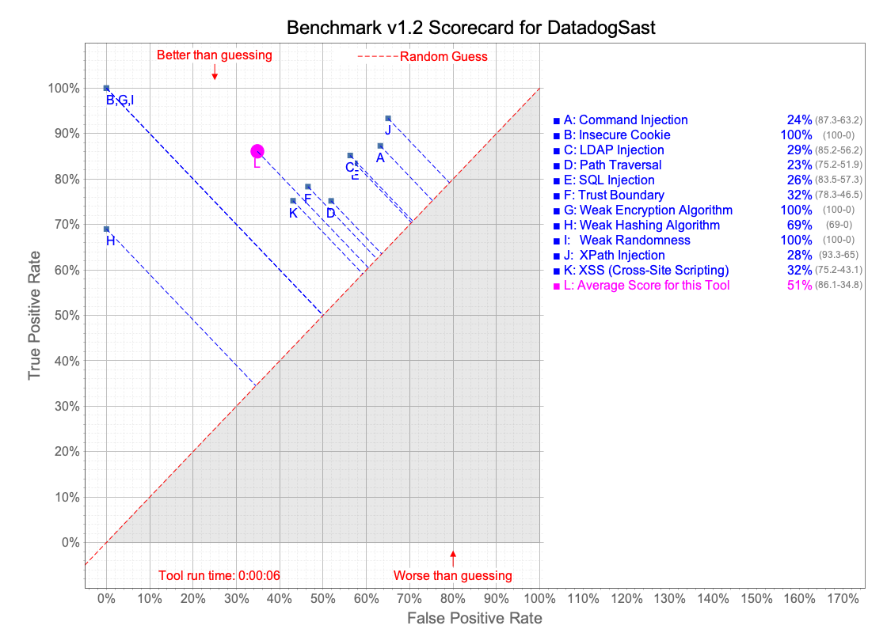

## Running OWASP benchmark

### Requirements

 - Java 11 ([OpenJDK for example](https://openjdk.org/install/))
 - [Maven](https://maven.apache.org/install.html)
 - [Rust toolchain](https://rustup.rs/)


### Benchmark results

These are the results of the OWASP Benchmark for the Datadog Static Analyzer as of 05/15/2025.




### Step 1: Clone and install the BenchmarkUtils repository
The [BenchmarkUtils](https://github.com/juli1/BenchmarkUtils) repository has utility methods to parse SARIF files from our static analyzer and associate CWE. We updated it to support our SARIF format.

First, clone the repository

```
git clone https://github.com/juli1/BenchmarkUtils
```

Switch to the branch `juli1/add-datadog-support`

```
cd BenchmarkUtils && git checkout juli1/add-datadog-support
```

Then, compile and install the library. It will install it in your local maven repository.

```
mvn compile && mvn install
```


### Step 2: Clone BenchmarkJava
The [BenchmarkJava](https://github.com/OWASP-Benchmark/BenchmarkJava.git) repository contains
all the code to analyze and generate the scorecards.

Clone it on your local machine.

```
git clone https://github.com/OWASP-Benchmark/BenchmarkJava.git
```


### Step 3: Run our static analyzer

Clone our static analyzer using the following command.

```
git clone https://github.com/DataDog/datadog-static-analyzer.git

```

Then, run it. At the top directory of the static analyzer, use

```
cd datadog-static-analyzer && cargo run --locked --release --bin datadog-static-analyzer -- --format sarif --output /path/to/BenchmarkJava/results/Benchmark_1.2-DatadogSast.sarif --directory /path/to/BenchmarkJava
```


### Step 4: Create Scorecards

Create the scorecards from the `BenchmarkJava` repository (the one created during step 2).

```
cd /path/to/BenchmarkJava/ && ./createScorecards.sh

```

The scorecards are then in the `scorecard/` directory.
